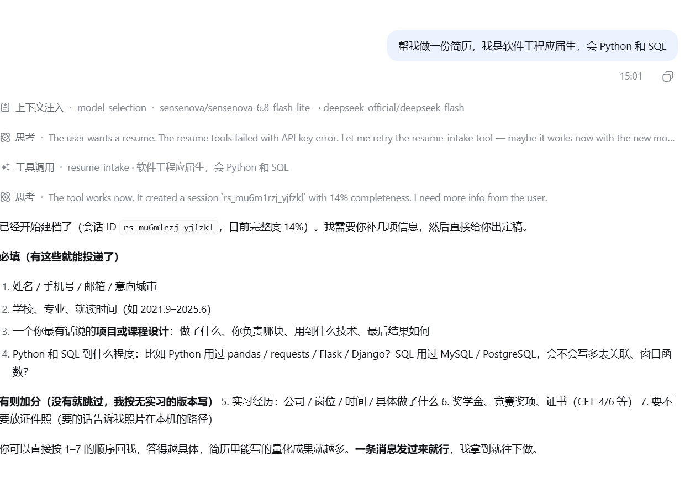
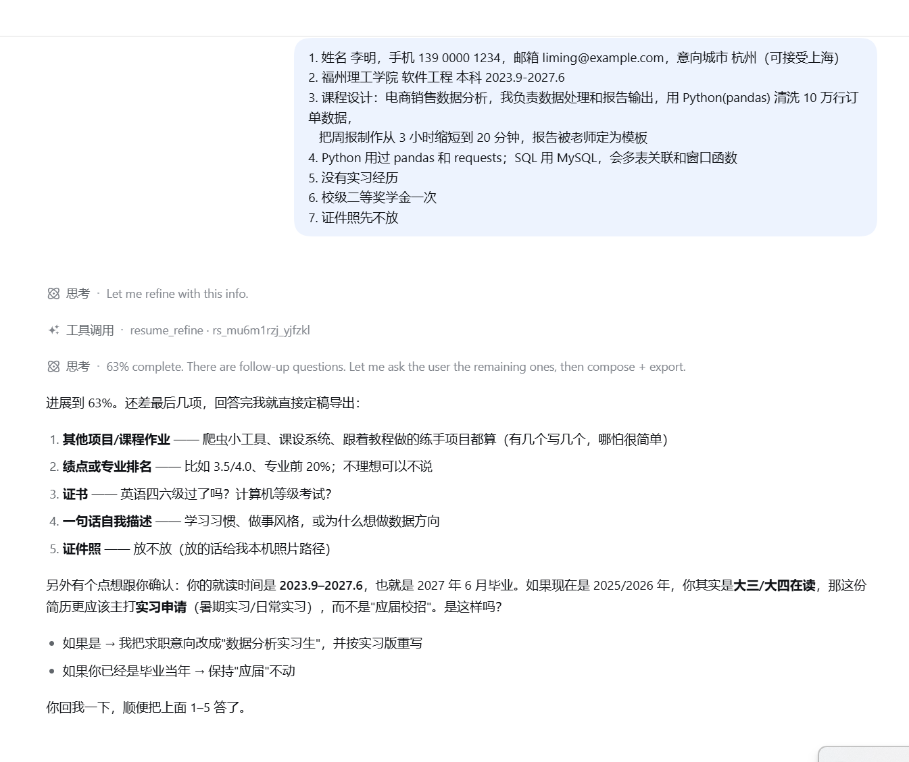
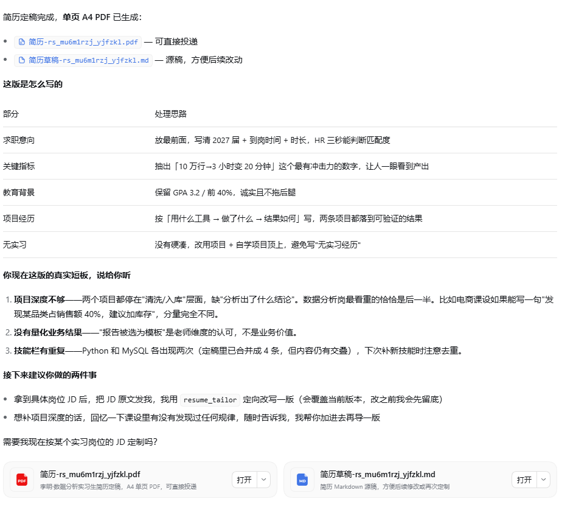
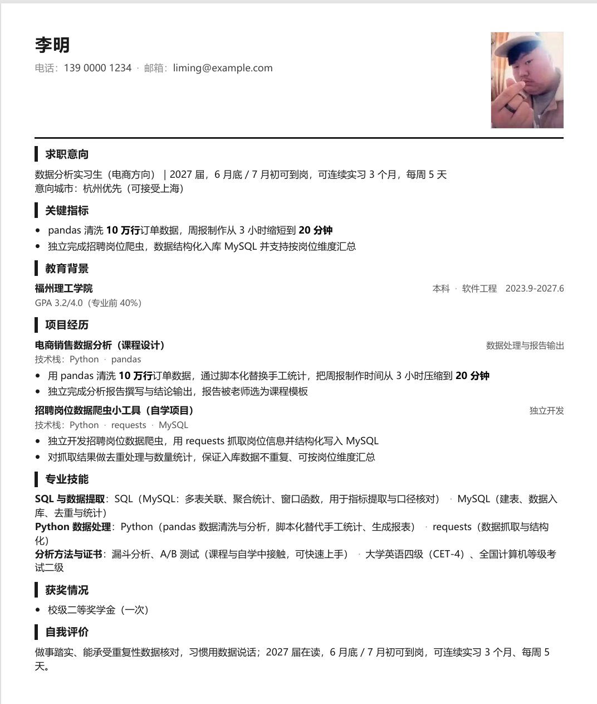

# dsh-resume-expert · 简历专家插件（DSH 版）

引导式简历生成插件：用户说一句"帮我做份简历"，插件先诊断、再一轮一轮引导补齐，最终产出**可直接投递的单页 A4 PDF**。

已在两个宿主实跑验证：自研 Demo 宿主 + **DeepSeek Harness 0.1.5**。471 项自动化验收。

## 效果预览

<table>
<tr>
<td width="50%">

<br><sub><b>① 首轮诊断</b>——一句模糊需求，返回第一版文字稿、完整度评估与待补充清单</sub>
</td>
<td width="50%">

<br><sub><b>② 多轮补全</b>——吸收补充信息，关键信息主动追问（学制 / 实习 or 校招口径）</sub>
</td>
</tr>
<tr>
<td width="50%">

<br><sub><b>③ 成稿导出</b>——定稿落盘，并逐条说明"这版简历是怎么写出来的"</sub>
</td>
<td width="50%">

<br><sub><b>④ 单页 A4 PDF</b>——真实排版直出，可直接投递</sub>
</td>
</tr>
</table>

## 安装

需要 DeepSeek Harness ≥ 0.1.5 与 Node.js ≥ 22。

```bash
# 推荐：固定版本，结果可复现
dsh plugin --profile web add github:wmw343/dsh-resume-expert#v1.0.1

# 或：跟随 main 最新提交
dsh plugin --profile web add github:wmw343/dsh-resume-expert
```

设置环境变量 `DEEPSEEK_API_KEY`（模型调用由插件适配层直连 DeepSeek API，密钥不出宿主环境）：

```powershell
# 写入 DSH 主目录的 .env
Add-Content "$env:USERPROFILE\.dsh\.env" "DEEPSEEK_API_KEY=sk-你的Key"
```

启动 `dsh web`，在会话里直接说 **"帮我做一份简历，我是××专业应届生，会××和××"**。

会话默认持久化到 `~/.dsh/resume-expert-store.json`——重启 `dsh web` 不丢草稿；可用环境变量 `RESUME_EXPERT_STORE` 指定存储路径。

## 工作方式

用户在对话里自然表达，Agent 自主调用 6 个工具完成四阶段：

| 工具 | 阶段 | 作用 |
|---|---|---|
| `resume_intake` | 首轮诊断 | 一句模糊需求 → 第一版文字稿 + 待补充清单 + 追问 |
| `resume_refine` | 迭代补全 | 多轮吸收用户补充（姓名/教育/实习/项目/技能） |
| `resume_compose` | 成稿 | 整合成可直接投递的定稿（删除占位、只留有信息量的内容） |
| `resume_export` | 导出 | A4 排版直出 PDF（本机无 Chrome 时降级为可打印 HTML） |
| `resume_set_photo` | 证件照 | 本机图片 → 简历右上角 |
| `resume_tailor` | JD 定制 | 按目标岗位 JD 重写简历 |

简历质量规则内建：量化句式（手段在前、结果在后，"从 A 到 B"式表达）、关键数字加粗、技能分组、关键指标置顶（≤3 条）、城市分主次、手机号 3-4-4。

## 架构

```
DSH Agent ──工具调用──► 适配层（本包 src/adapter.ts）
                          │ 实现宿主契约：llm / auth / storage / telemetry / config / logger (+render)
                          ▼
                    简历专家插件核心（src/plugin/，框架无关、零依赖）
                          │ llm 调用直连 DeepSeek API（OpenAI 兼容）
                          ▼
                    A4 HTML ──Chrome CDP──► PDF
```

三条边界（可直接写进安全评审）：

- 插件**不持密钥**：模型凭证在适配层（宿主侧），接入方可对接自己的模型网关
- 插件**不落库、不外联**：会话状态经宿主 storage 存取
- 出入参全部可 JSON 序列化：为 iframe / 子进程隔离留路

## 验收

插件核心 **471 项自动化验收**：内核 204（类型/渲染/合并/边界）+ 真实模型 70 + 端到端 37 + 真实浏览器 72 + 集成 58 + 启动器 30。导出 PDF 经 pypdf 实体解析验收（页数/纸张/结构/无占位残留）。

本适配层自带一套离线自测（**不需要网络、不需要启动 dsh**）：

```bash
npm install && npm run build   # 首次：装依赖 + 编译
npm test                       # 21 项：会话持久化的全部不变量
```

`npm test` 覆盖的是最容易被忽视也最要紧的一条——**跨进程存活**：它会真的起子进程，
模拟 `dsh web` 重启，验证上一进程写入的草稿能被下一进程读到并继续修改。
另有 TTL、原子写（不留 `.tmp`）、损坏自愈（改名留档而非崩掉）、防抖窗口内不丢数据。

## License

MIT —— 见 [LICENSE](./LICENSE)。
